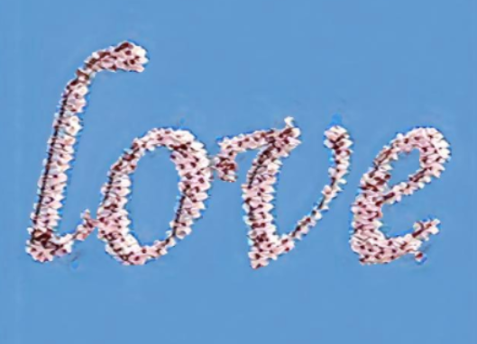

# Artistic Text Style Transfer for Complex Texture and Structure

<table border="0" width='90%'>
 <tr align="center">	
  <td width="18.6%"></td>
 </tr>
 <tr align="center">
  <td> Generated diverse artistic texts via the proposed framework
</tr>				
 
 
 </table>
 <table border="0" width='100%'>
 <tr align="center">
  <td width="36%"></td>	
  <td width="28%"></td>	
  <td width="36%"></td>			
 </tr>					 
 <tr align="center">
</tr>	
</table>

 </table>
 <table border="0" width='100%'>
 <tr align="center">
  <td width="20%"></td>	
  <td width="35%"></td>	
  <td width="22%"></td>			
  <td width="23%"></td>		
 </tr>					 
 <tr align="center">
  <td> High-resolution <td> artistic text images generated <td> by the proposed <td> framework
</tr>	
</table>


This is a pytorch implementation of the paper.

Wendong Mao, Shuai Yang; Huihong Shi, Jiaying Liu, and Zhongfeng Wang,  "Intelligent Typography: Artistic Text Style Transfer for Complex Texture and Structure"  in IEEE Transactions on Multimedia: Regular Paper, 2022.

[[Paper]](https://ieeexplore.ieee.org/abstract/document/9906917) | More about artistic text style transfer 

Please consider citing our paper if you find the software useful for your work.


## Usage: 

#### Prerequisites
- Python 3.6
- Pytorch 1.8.0
- matplotlib
- opencv
- scipy
- Pillow
- visdom


#### Install
- Clone this repo:
```
git clone https://github.com/WendongMao/Intelligent_Typography.git
```
## Testing Example

- Download pre-trained G_p and N_s models and input images from  [[Baidu Cloud]](https://pan.baidu.com/s/1yzljdGDoJCPxDKsQetp2qA)(code:lglo)
  - Load the pre-trained G_p and N_s into the paths: `./pro_gen_GAN/checkpoints/Gp1/`,`./pro_gen_GAN/checkpoints/Gp2/`, `./Structure_Net/models/`,
- Download pre-trained VGG model from  [[Baidu Cloud]](https://pan.baidu.com/s/1vUBiAvUV8qq9vgtObifIAw)(code:yxto) , and load into the path: `./pro_gen_GAN/Models/`

- Artisic text style transfer using default style-scale 0.0
  ```
  python Forward_pro_gen.py --Gp1path "XXX"  --picpath "XXX" --tpath "XX" --Gp2path "XXh" --deforml X \
  python ./Structure_Net/style.py transfer --model-path "XXX" --source "./Gp1_prototype.jpg" --output "./Ns_result.jpg" \
  python ./Texture_Net/texture_refine.py --picpath "XXX"  
  ```
   - where `Gp1path` and `Gp2path` represent the pre-trained model paths for Gp1 and Gp2, `picpath` denotes the data path of style image, and `tpath` implies the data path of text mask. Eg:
  ```
  python Forward_pro_gen.py --Gp1path "./pro_gen_GAN/checkpoints/Gp1/ink_8000_net_G.pth"  --picpath "./pro_gen_GAN/image_preparation/test_case/202ink/train/2.jpg" --tpath "./image_preparation/text_mask/mo.jpg" --Gp2path "./pro_gen_GAN/checkpoints/Gp1/ink_8000_net_G.pth" --deforml 0 \
  python ./Structure_Net/style.py transfer --model-path "./Structure_Net/models/ink.model" --source "./Gp1_prototype.jpg" --output "./Ns_result.jpg" \
  python ./Texture_Net/texture_refine.py  --picpath "./pro_gen_GAN/image_preparation/test_case/202ink/train/1.jpg"
  ```
  - Results for Gp, Ns and Nt can be found in `./Gp1_prototype.jpg`,`./Gp2_segmask.jpg`, `./Ns_result.jpg`, `./Nt_results.jpg`


- Artisic text style transfer with specified parameters
  - setting parameters --deforml of Forward_pro_gen.py from 0 to 1,2,3,4 means testing with multiple scales 
  - specify the input text name, output image path and name with text_name, result_dir and name, respectively


 or just modifying and running

- For Artisic text style transfer with default parameters
 ```
 sh ./Coarse2fine_transfer.sh
 ```

- For Artisic text style transfer with optional style-scales
 ```
 sh ./Coarse2fine_deform.sh
 ```

- For relatively simple text styles with alternative inference steps
 ```
 sh ./Coarse2fine_altern.sh
 ```


## Training Examples

### Training Prototype Generation Pro-Gen GAN
```
cd ./pro_gen_GAN
```
- Download style images from  [[Baidu Cloud]](https://pan.baidu.com/s/1yzljdGDoJCPxDKsQetp2qA)(code:lglo) to `./pro_gen_GAN/datasets/half/`
- Train G_p1 with default parameters

  just modifying and running
  ```
  sh ./script/train_Gp1.sh
  ```
Saved model can be found at `./checkpoints/Gp1`


- Train G_p2 with default parameters
  ```
  python train.py --dataroot ./datasets/half/202 --name Gp2 --use_style --no_flip --no_lsgan --model half_style --which_model_netG Gp_2  --lambda_A 100 --norm batch  --niter_decay 500 --niter 500 --save_epoch_freq 200  --path_model_Gp1 "XXX" --gpu_ids 0
  ```
  - where `path_model_Gp1` represents the pre-trained model paths for Gp1.

  - or just modifying and running
  ```
  sh ./script/train_Gp2.sh
  ```
Saved model can be found at `./checkpoints/Gp2`


### Training Structure Refinement N_S
```
cd ./Structure_Net
```

- Train N_S with default parameters

 just modifying and running
 ```
 sh train.sh
 ```
Saved model can be found at `./models`


### Texture Refinement N_t

- N_t uses a pretrained VGG and does not require training
  - Download pre-trained VGG19 from  [[Baidu Cloud]](https://pan.baidu.com/s/1SsgvvT5nKKiGTyr2xHpveQ)(code:w4v9), and load into the path:`./Texture_Net`


### Try with Your Own Style images
```
cd ./image_preparation
```
- Style image preparation for network training
  - Put the style images and text mask into the corresponding folders: `./style_img/` and `./text_mask/`. Name the style image as XXX1 and XXX2, (Eg. leaf1 and leaf2), where leaf1 is global style image and leaf2 is local style image.
  ```
  python make_restdir.py
  ```
  - A folder containing global/local images/masks can be generated (`./test_case/202xxx/`), and the degree of mask smoothness can be adjusted by changing the kernel size of gaussian filter. The directory & file structure is like this:
  ```
  |---test
  |   └───textname_stylename.jpg
  |---train
  |  └───1.jpg
  |  └───2.jpg
  |---label
  |  └───dismap.jpg
  |---mask1_O.jpg
  |---mask1.jpg
  |---mask2_O.jpg
  |---mask2.jpg
  ```
  - Move the generated folder(`202xxx/`) into the corresponding datapath `./pro_gen_GAN/datasets/half/`.
  - Noting: For the colour distinct style image, the code uses a threshold to judge the pixel of style image, then obtaining the 
binary masks. If the style image has complex color distribution, the generated binary mask will be mixed with the background. For these images with complex color, you can extract their binary masks by yourselves, and then replace the generated masks in the target folder for network training.

Have fun :-)

### Contact

Wendong Mao

wdmao@smail.nju.edu.cn
